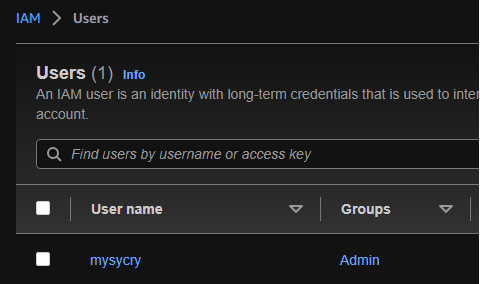
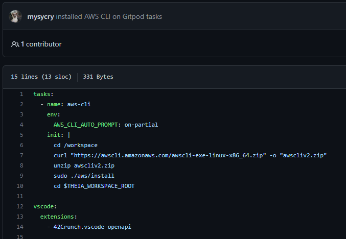
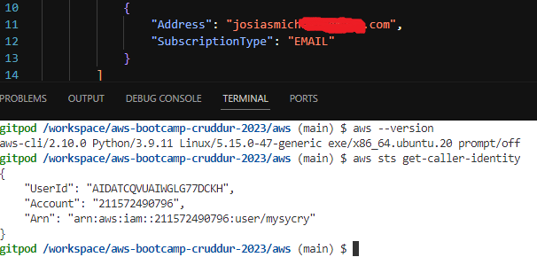
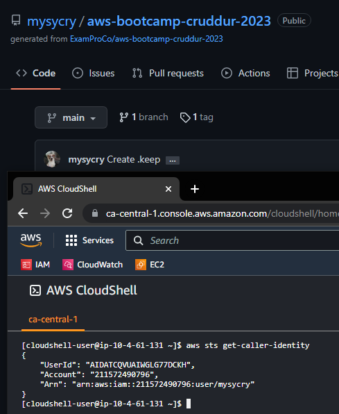
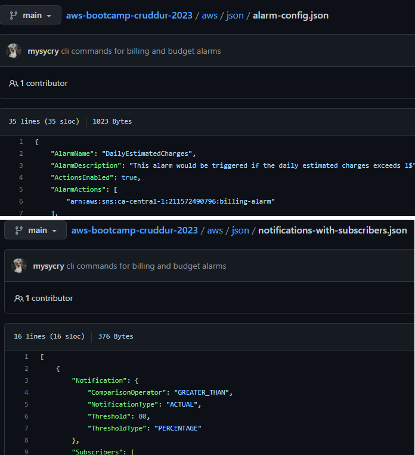
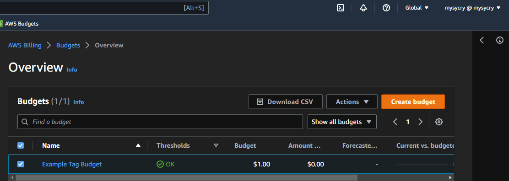
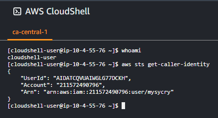
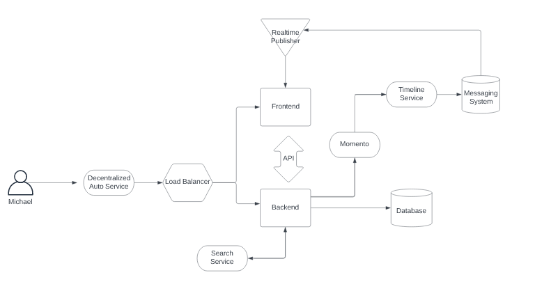
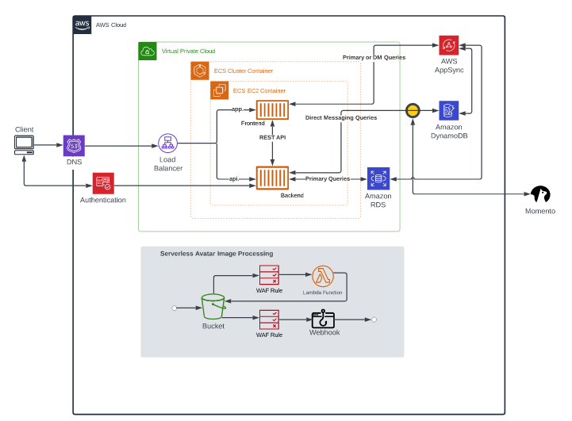

# Week 0 — Billing and Architecture

## Required Homework

i created an admin user  

i installed AWS CLI  
  

Proof that AWS CLI works  
 

i generated AWS credentials  

I generated AWS Billing Alarm  

  

I generated AWS Budget  
  

I open AWS Cloudshell from the AWS Console  

I draw a napkin diagram on Lucid  
  
[Link to Lucid Napkin Diagram](https://lucid.app/lucidchart/invitations/accept/inv_c15e23bb-e51d-46af-8893-460835bcaaa2) 

I draw a logical diagram on Lucid  
  
[Link to Lucid Logical Diagram](https://lucid.app/lucidchart/fc7190e0-9025-45bd-9392-a8a10fcbefe4/edit?invitationId=inv_c15219ce-903c-4b4b-92aa-2a7202edb420) 
  
  
  

## Homework Challenges  
  
  

