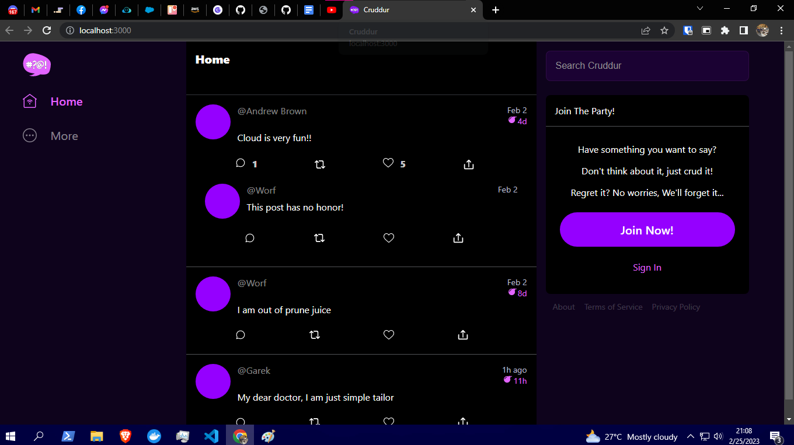
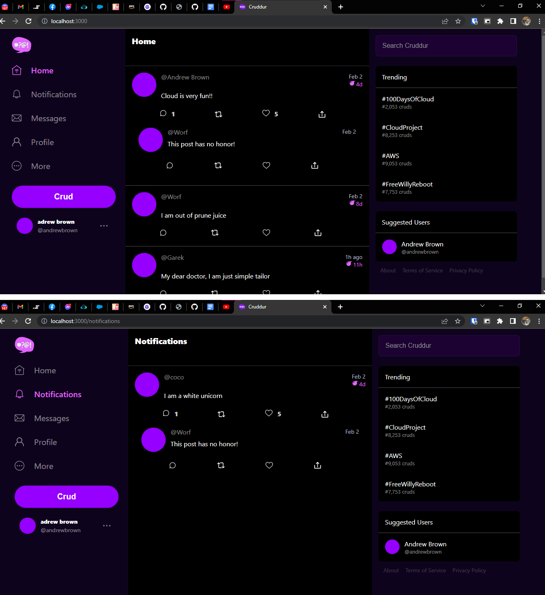
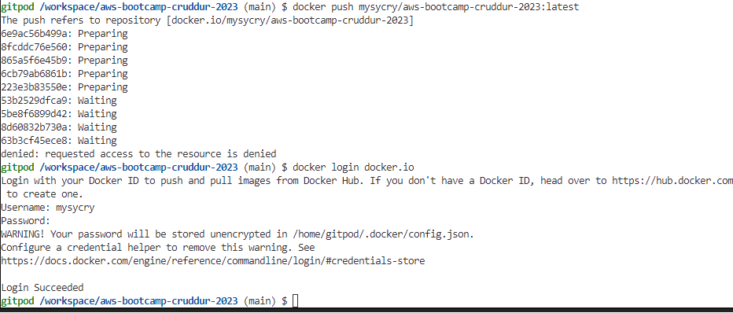
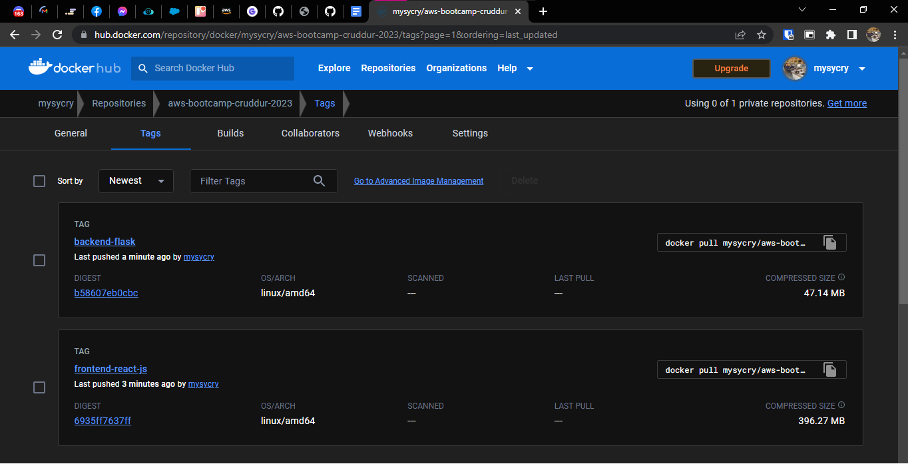
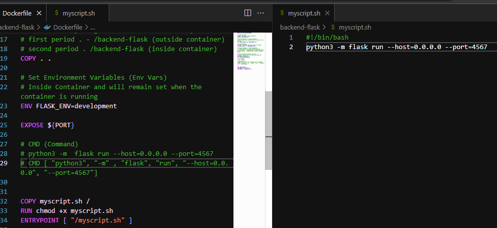
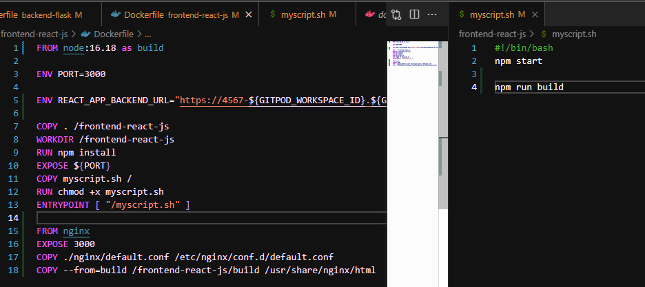
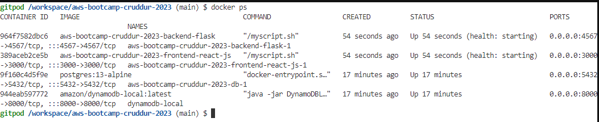
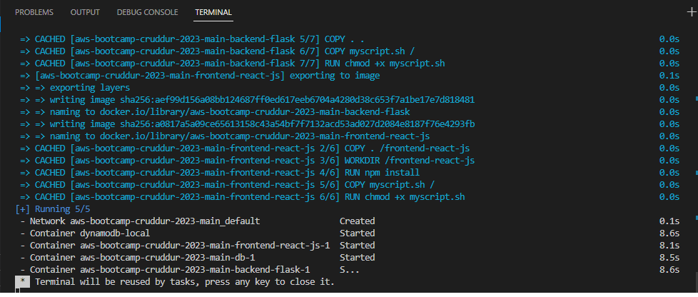
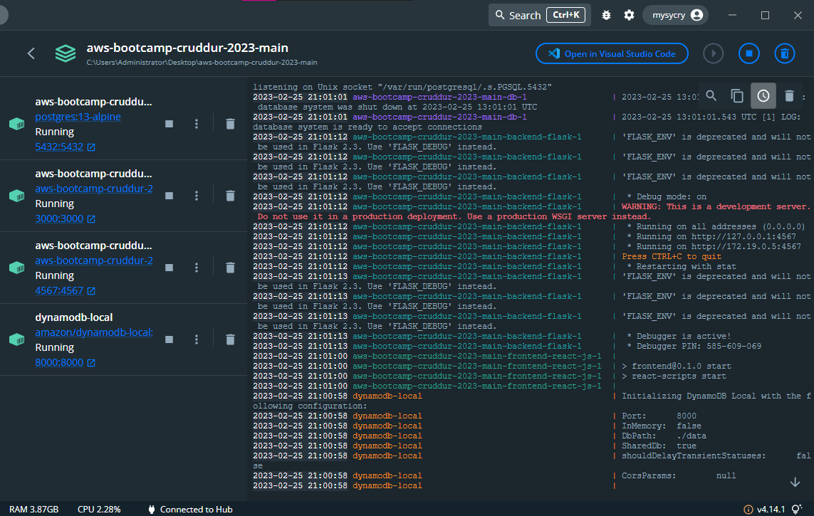

# Week 1 — App Containerization

I watch and follow all the videos on the Youtube playlist. Andrew, Lane and the Docker Captains provided great insight during the stream. Very much appreciated.  


I commit and push all changes I made on Gitpod to my public repo in Github. I had an issue during week0 but after a quick search, I just need to enable a push permission to Github on Gitpod settings.  


I wrote a React Page for Notifications on my Cruddur app and it communicates with the Backend. Works both in Gitpod and in Local
  
  


I run a Postgres container and DynamoDb local based on the video that Andrew uploaded. Backend was also updated based on the video.

```  - name: postgres
    init: |
      curl -fsSL https://www.postgresql.org/media/keys/ACCC4CF8.asc|sudo gpg --dearmor -o /etc/apt/trusted.gpg.d/postgresql.gpg
      echo "deb http://apt.postgresql.org/pub/repos/apt/ `lsb_release -cs`-pgdg main" |sudo tee  /etc/apt/sources.list.d/pgdg.list
      sudo apt update
      sudo apt install -y postgresql-client-13 libpq-dev
```


I also pushed images to Dockerhub. I ran into an issue wherein pushing is denied but after a quick search, I just have to login my Docker account on the terminal.  
  
  

I run a CMD external script and when I run it, I encountered an error and I solve it by running execute chmod +x filenamesample.sh on the terminal and I run it again.  
  
  

I wrote a HEALTHCHECK on my docker-compose for both frontend and backend.


I also downloaded my project repo and run it locally on my Windows machine. I have to change env vars to localhost so that I will not run into an error. I also login my Docker account and AWS Access and Secret Access Keys from the terminal. I was successful in running the 4 containers.  
  

