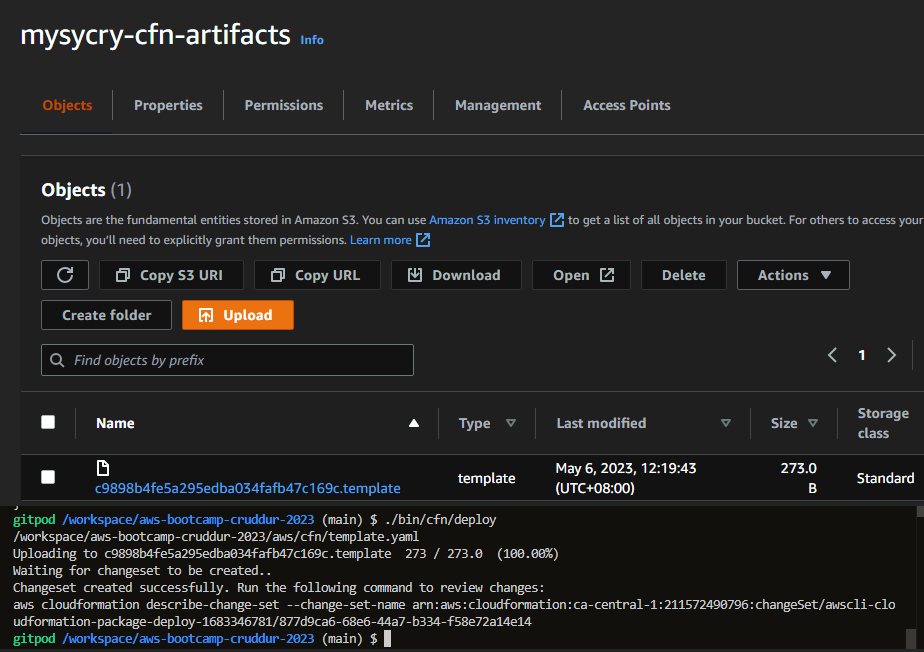
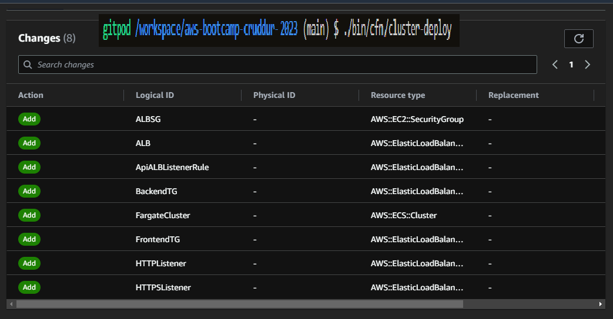

# Week 10 — CloudFormation Part 1  

## Architecture Guide  

Before you run any templates, be sure to create an S3 bucket to contain all of our artifacts for CloudFormation.  

```
aws s3 mk s3://mysycry-cfn-artifacts
export CFN_BUCKET="mysycry-cfn-artifacts"
gp env CFN_BUCKET="mysycry-cfn-artifacts"
```  

  

Create template.yaml in the cfn root directory then validate it.  
  

Edit .gitpod.yml to include installing cfn-lint and cfn-guard.  
```
- name: cfn  
  before: |  
    pip install cfn-lint  
    cargo install cfn-guard  
```  

AWS CloudFormation Linter (cfn-lint) is an open-source tool that you can use to perform detailed validation on your AWS CloudFormation templates.  

cfn-guard is an open-source command line interface (CLI) that checks CloudFormation templates for policy compliance using a simple, policy-as-code, declarative language.  
 

++++++++++++++++++++++++++ NETWORKING ++++++++++++++++++++++++++++++  
Networking stack includes:  

```  
  - VPC
    - sets DNS hostnames for EC2 instances
    - Only IPV4, IPV6 is disabled
  - InternetGateway
  - Route Table
    - route to the IGW
    - route to Local
  - 6 Subnets Explicity Associated to Route Table
    - 3 Public Subnets numbered 1 to 3
    - 3 Private Subnets numbered 1 to 3  
```  

Every stack have a .toml file where you explicitly define the bucket where the file will be uploaded, the region and the stack name. This is also where you define the parameters for the said stack.  

Sample .toml:  
```  
[deploy]
bucket = ''
region = ''
stack_name = ''  
```

Networking Diagram:  
  

++++++++++++++++++++++++++ CLUSTER ++++++++++++++++++++++++++++++  

Our Cluster stack includes:  
```  
- ECS Fargate Cluster
  - Application Load Balanacer (ALB)
    - ipv4 only
    - internet facing
    - certificate attached from Amazon Certification Manager (ACM)
  - ALB Security Group
  - HTTPS Listener
    - send naked domain to frontend Target Group
    - send api. subdomain to backend Target Group
  - HTTP Listener
    - redirects to HTTPS Listener
  - Backend Target Group
  - Frontend Target Group  
```

If running changeset in the terminal is successful, you can see in Cloudformation Stack in AWS Console the resources that will be added.  
 

If your deploy is successful, you can see it like this.  
  

++++++++++++++++++++++++++ BACKEND SERVICE ++++++++++++++++++++++++  

Our Backend Service stack includes:  
```  
  Task Definition
  Fargate Service
  Execution Role
  Task Role  
```  

In the Parameters of our template.yaml, you can refer to our previous stacks  like this:  
```  
  NetworkingStack:
    Type: String
    Description: This is our base layer of networking components eg. VPC, Subnets
    Default: CrdNet
  ClusterStack:
    Type: String
    Description: This is our cluster layer eg. ECS Cluster, ALB
    Default: CrdCluster  
```

You can also refer to our Secret ARNs in the Parameter Store. e.g.  
```  
  SecretsAWSAccessKeyId:
    Type: String
    Default: 'arn:aws:ssm:ca-central-1:211572490796:parameter/cruddur/backend-flask/AWS_ACCESS_KEY_ID'
  SecretsSecretAccessKey:
    Type: String
    Default: 'arn:aws:ssm:ca-central-1:211572490796:parameter/cruddur/backend-flask/AWS_SECRET_ACCESS_KEY'  
```  

I encountered errors after deploying. Task in ECS Fargate keeps failing. The solution is to override and change the BackendHealthCheckPort to 4567 instead of 80 in cluster/template.yaml  
  

  

  

After the override:  
  

The solution for this is to change the namespace into something else. The reason is that I choose not to delete my previous Fargate service. I just set the desired-task to zero on it.  
  

Since we deployed a new service, we also need to change the load balancer in our Route53 alias for api.cloudmate.tech into our CrdClusterALB that was created when we deploy our Cluster stack.  
  

Logs:  
  

api/health-check:  
  
++++++++++++++++++++++++++ DB (RDS) ++++++++++++++++++++++++++++++  

In the config.toml, define the deploy bucket, region and the stack_name. In the parameters, refer to the previous stacks like  
```  
[parameters]
NetworkingStack = 'CrdNet'
ClusterStack = 'CrdCluster'
MasterUsername = 'xxxxx'
```
Also the DB MasterUsername should be defined there as well.  

The template.yaml will have:  
```  
  The primary Postgres RDS Database for the application
  - RDS Instance
  - Database Security Group
  - DBSubnetGroup
```  

++++++++++++++++++++++++++ DynamoDB (SAM) ++++++++++++++++++++++++  

We need to install SAM CLI in the terminal and include it in our gitpod.yml  
```  
  - name: aws-sam
    init: |
      cd /workspace
      pip install -r requirements.txt
      wget https://github.com/aws/aws-sam-cli/releases/latest/download/aws-sam-cli-linux-x86_64.zip
      unzip aws-sam-cli-linux-x86_64.zip -d sam-installation
      sudo ./sam-installation/install
      cd $THEIA_WORKSPACE_ROOT  
```  

  


template.yaml includes:  
```  
  - DynamoDB Table
  - DynamoDB Stream  
```  

We made a bin/sam/ddb folder where we put the build, package and deploy scripts.  

Execute Build will create a build package on .aws-sam.  
  

SAM Build:   
  
  

SAM Package:  
  

SAM Deploy:  
  
  

CruddurDdb stack successful deploy.  
  


++++++++++++++++++++++++++ CI/CD ++++++++++++++++++++++++++++++  

We need to create a "Nested" folder inside our cicd directory. This is where we put our codebuild.yaml and template.yaml that will serve as  
```  
  Codebuild used for baking container images
  - Codebuild Project
  - Codebuild Project Role 
```  
```  
  - CodeStar Connection V2 Github
  - CodePipeline
  - Codebuild  
```  

When we deploy, we need to package the build first to S3.  

++++++++++++++++++++ STATIC HOSTING FRONTEND +++++++++++++++++++  

Our template.yaml includes:  
```  
  - CloudFront Distribution
  - S3 Bucket for www.
  - S3 Bucket for naked domain
  - Bucket Policy  
```  

We need RootBucket to store our IndexDocument and ErrorDocument.  

I need to request for an increase to create the Distribution.   
  

Another error I encountered is this wherein I use my own HostedZoneId wherein fact, you just need to use the one Cloudfront provided in the docs.  
  

+++++++++++++++ COMPLETE ARCHITECTURAL DIAGRAM ++++++++++++++++  

  
  


