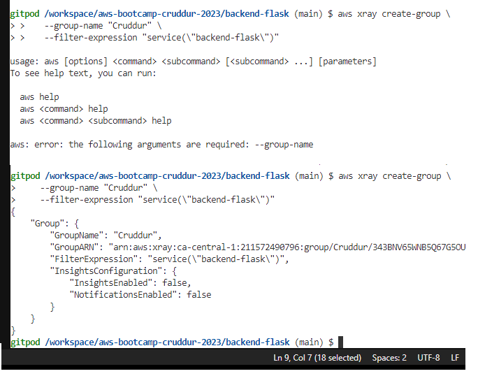
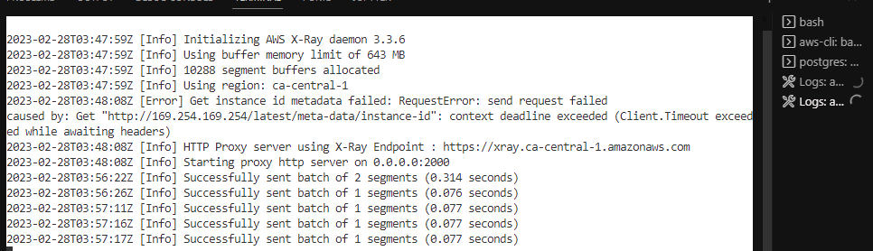
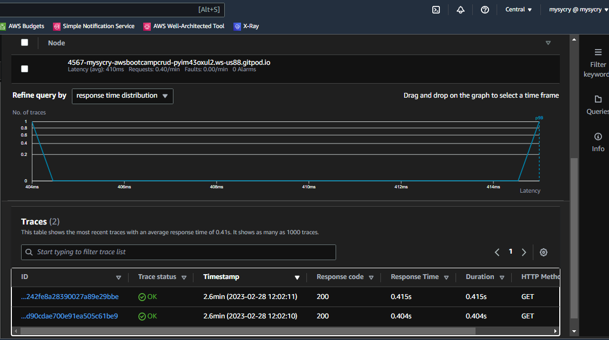
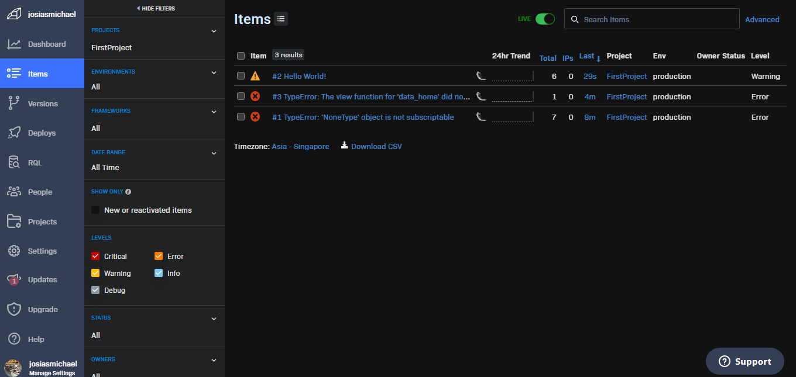
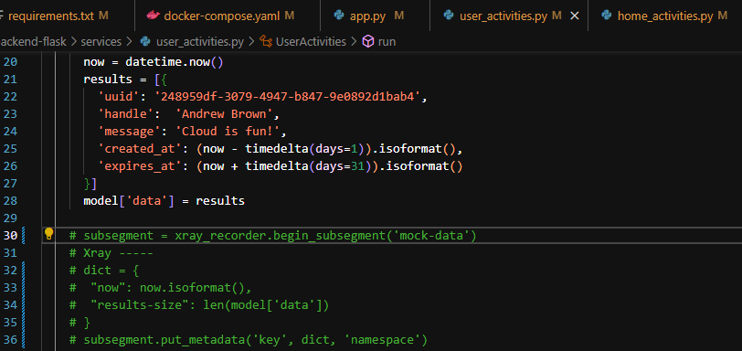

# Week 2 — Distributed Tracing

I attended the livestream and I love this week's guests. Full of insights on the topic. The students are attentive as well.  

I watch the new videos uploaded on the YT playlist.  

I also added AWS Xray SDK on requirements.txt and app.py.  
I also added Deamon Service to Docker Compose.

I added Honeycomb on requirements.txt and app.py. I then installed the dependencies

I added env vars on docker-compose  
```
OTEL_EXPORTER_OTLP_ENDPOINT: "https://api.honeycomb.io"
OTEL_EXPORTER_OTLP_HEADERS: "x-honeycomb-team=${HONEYCOMB_API_KEY}"
OTEL_SERVICE_NAME: "${HONEYCOMB_SERVICE_NAME}"
```
I added Watchtower and Rollbar on requirements.txt and app.py.   

I made an AWS Xray groupname via AWS CLI  
  

Daemon Logs sent:
  

Xray traces on my AWS Console
  


Log Group Events  
  

Rollbar sending data
  

Commenting out week2-tracing codes on my repo to avoid being charged eventho the free tier on services are generous enough to give a big amount to work with.  
  
