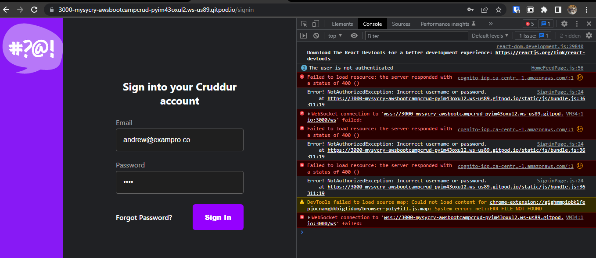
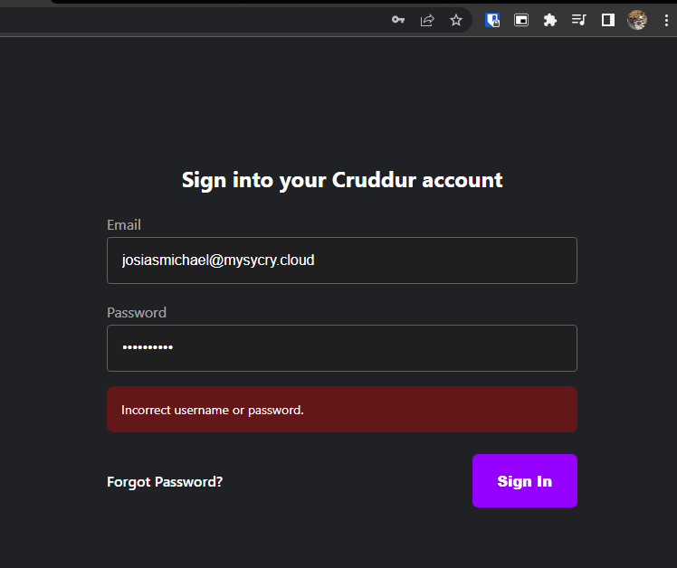
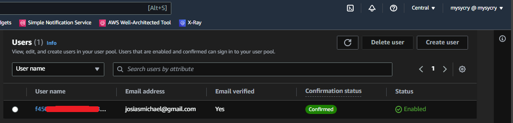
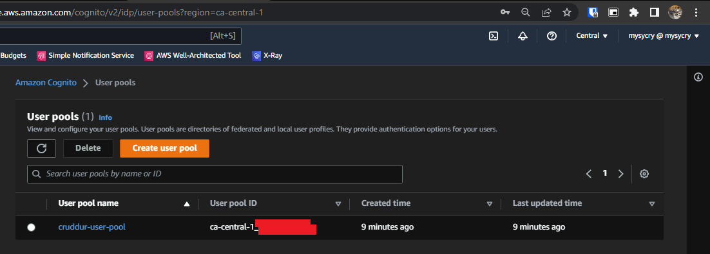
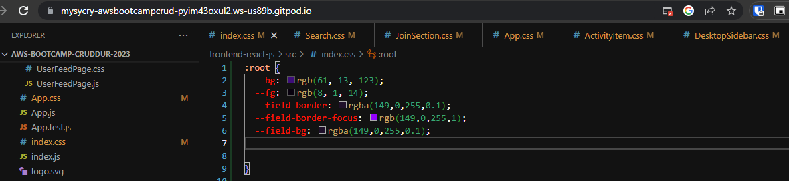
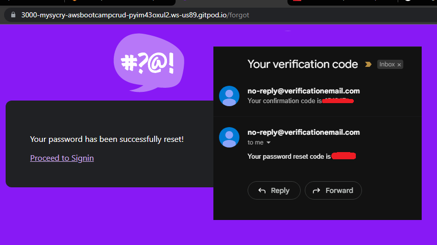

# Week 3 — Decentralized Authentication

I watched the new videos uploaded on the playlist

I install Amplify for Cognito and env vars on docker-compose  
```js
import { Amplify } from 'aws-amplify';

Amplify.configure({
  "AWS_PROJECT_REGION": process.env.REACT_APP_AWS_PROJECT_REGION,
  "aws_cognito_region": process.env.REACT_APP_AWS_COGNITO_REGION,
  "aws_user_pools_id": process.env.REACT_APP_AWS_USER_POOLS_ID,
  "aws_user_pools_web_client_id": process.env.REACT_APP_CLIENT_ID,
  "oauth": {},
  Auth: {
    // We are not using an Identity Pool
    // identityPoolId: process.env.REACT_APP_IDENTITY_POOL_ID, // REQUIRED - Amazon Cognito Identity Pool ID
    region: process.env.REACT_AWS_PROJECT_REGION,           // REQUIRED - Amazon Cognito Region
    userPoolId: process.env.REACT_APP_AWS_USER_POOLS_ID,         // OPTIONAL - Amazon Cognito User Pool ID
    userPoolWebClientId: process.env.REACT_APP_AWS_USER_POOLS_WEB_CLIENT_ID,   // OPTIONAL - Amazon Cognito Web Client ID (26-char alphanumeric string)
  }
});
```


Expected Error since no user has been created yet
  
  

I created a user pool  
  
  


I implement API calls to Cognito for login, signup, recovery and forgot password.  
``` js
import { Auth } from 'aws-amplify';
```

```js
    try {
        await Auth.signOut({ global: true });
        window.location.href = "/"
    } catch (error) {
        console.log('error signing out: ', error);
    }
```
```js
    Auth.currentAuthenticatedUser({
      // Optional, By default is false. 
      // If set to true, this call will send a 
      // request to Cognito to get the latest user data
      bypassCache: false 
    })
    .then((user) => {
      console.log('user',user);
      return Auth.currentAuthenticatedUser()
    }).then((cognito_user) => {
        setUser({
          display_name: cognito_user.attributes.name,
          handle: cognito_user.attributes.preferred_username
        })
    })
    .catch((err) => console.log(err));

```
  
    
I verify JWT token server side for backend. On app.py:  
```py
from lib.cognito_jwt_token import CognitoJwtToken, extract_access_token, TokenVerifyError
```


I improve UI changes, CSS theme variables  
```css
:root {
  --bg: rgb(61, 13, 123);
  --fg: rgb(8, 1, 14);
  --field-border: rgba(255,255,255,0.29);
  --field-border-focus: rgb(149,0,255,1);
  --field-bg: rgba(31, 31, 31);
}
```
  

User Verification Codes received on email
  


