# Week 4 — Postgres and RDS


i watched and followed the additional videos after the livestream. Rewatched multiple times because of thousands of errors. Successfully overcame them all. Very challenging yet FULFILLING week.

I created a RDS Postgres Instance via terminal. Official documentation on this link:  
[AWS RDS CLI create-database docs](https://docs.aws.amazon.com/cli/latest/reference/rds/create-db-instance.html)   


i bash script inside the db shell and perform some actions and showing off the database explorer successful localhost connection on the left panel  
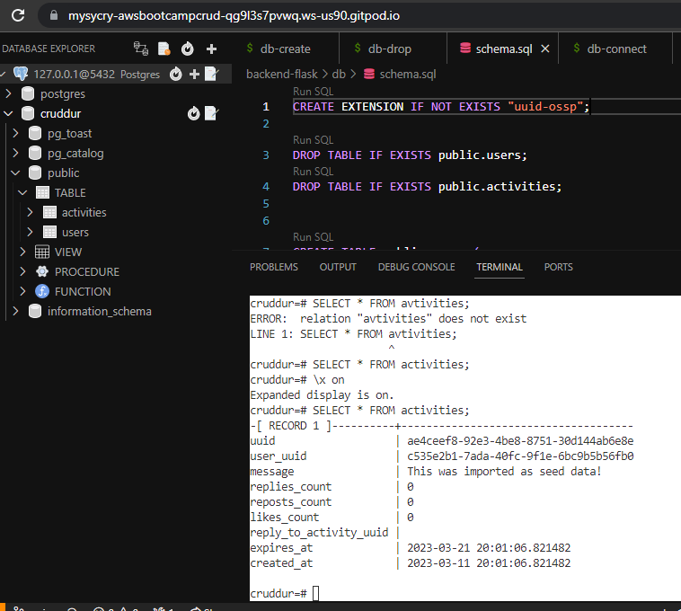  


setting env var in backend  
```py
backend-flask:
    environment:
      CONNECTION_URL: "${CONNECTION_URL}"
```
I have an executable file to setup the database(provided screenshot not yet the prod)  
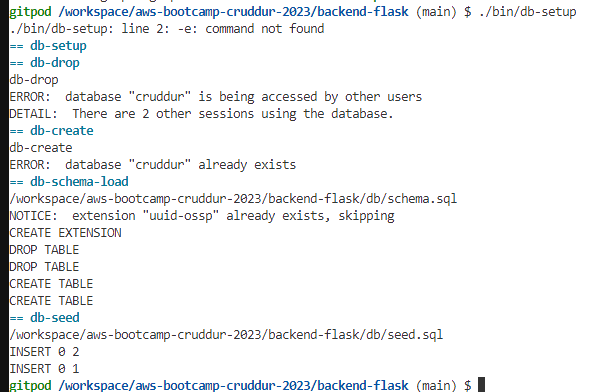 

More executable files  
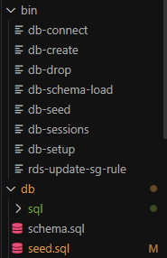  

Hardcoded posts working  
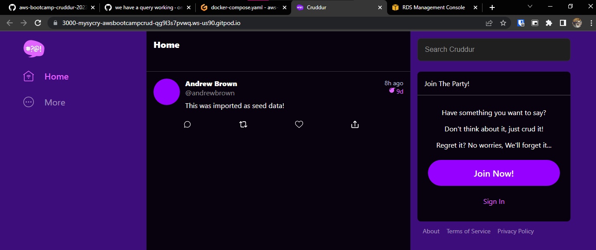 

I auto-update security group rules by inserting this to the CLI
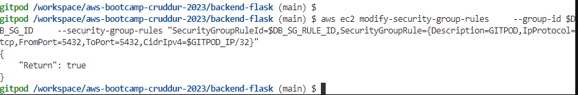  

Multiple tries to register and unregister the user  
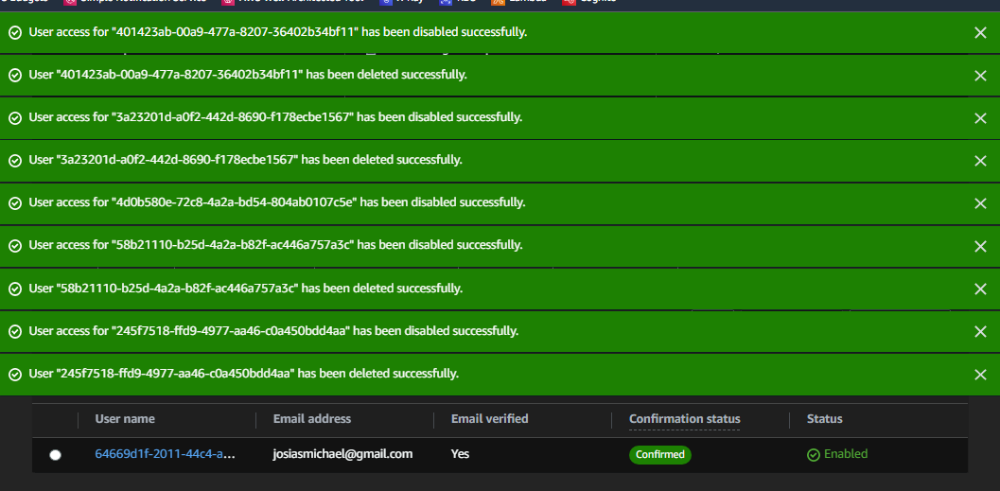  


I have deployed a Lambda function to confirm user information after app registration  
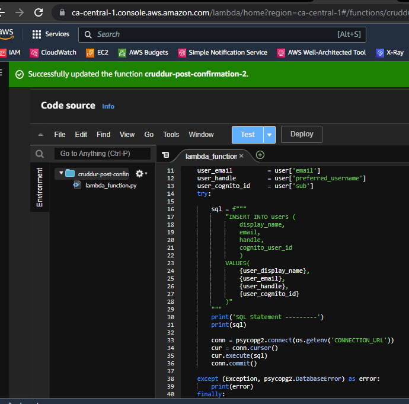 

Cloudwatch logs capture the information from the registration  
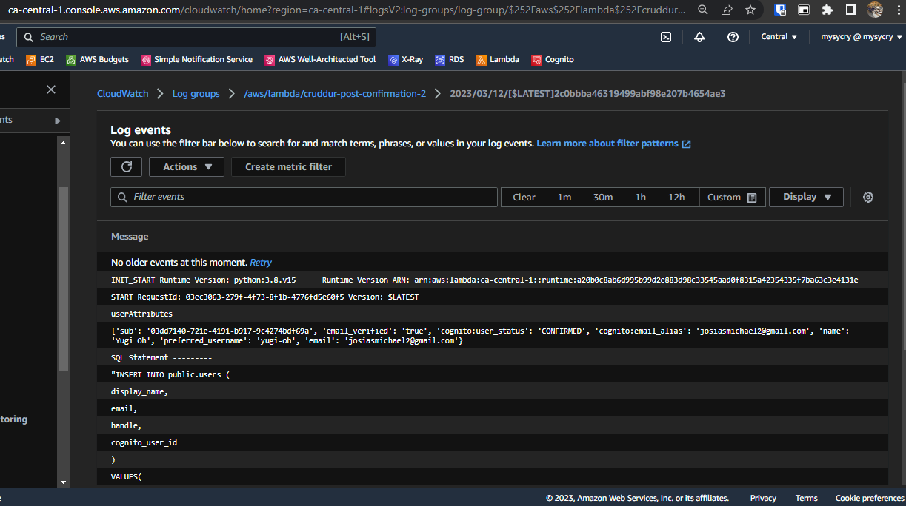 

I tested registering an existing user  
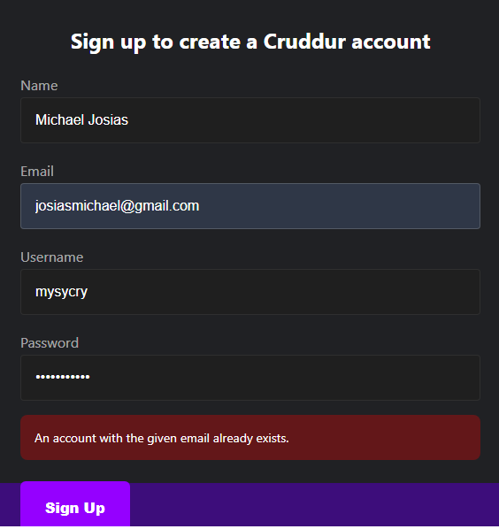  

Backend logs now with zero errors  
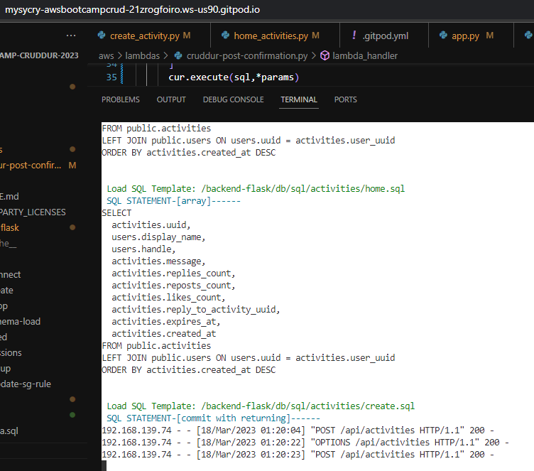  

Registered User posts finally shows up   
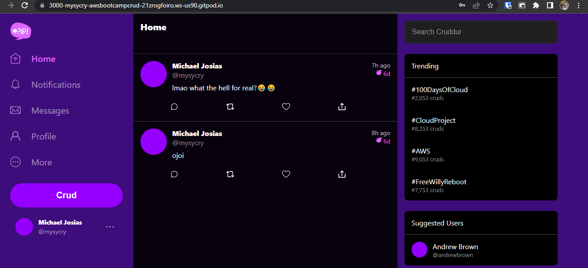 


i register users in Cruddur and they will be inserted into the database  
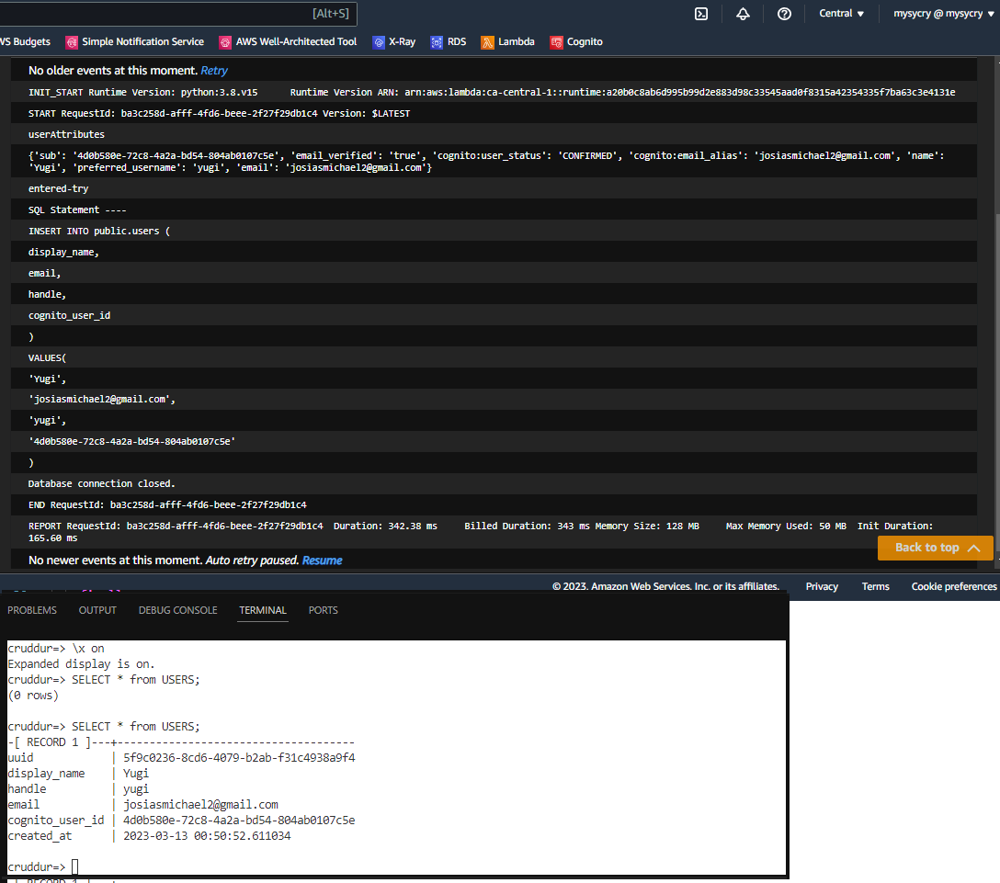  
   


i post on Cruddur and those will be inserted into the database  
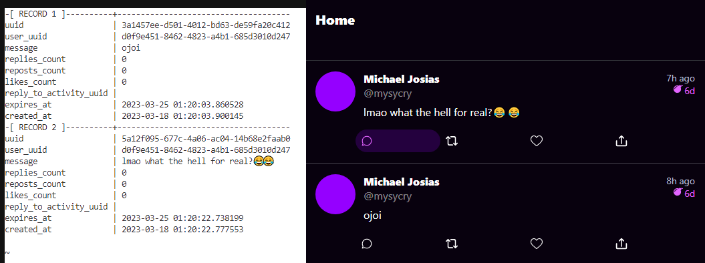 


