# Week 5 — DynamoDB and Serverless Caching

I watched all the videos for Week 5 DynamoDb and all its supplementary videos. Encountered a lot of errors but the Discord group are full of helpful people and I get my errors fixed.

I created a schema-load script, seed script, scan script, pattern scripts, update cognito ID script.
I then run them on this sequence:  

```js
./bin/db/setup
./bin/db/update_cognito_user_ids
./bin/ddb/schema-load
./bin/ddb/seed
./bin/ddb/patterns/get-conversation
./bin/ddb/patterns/list-conversations 
```

I connect to local database from the terminal  
 


I list the conversation by running ./bin/ddb/patterns/list-conversation
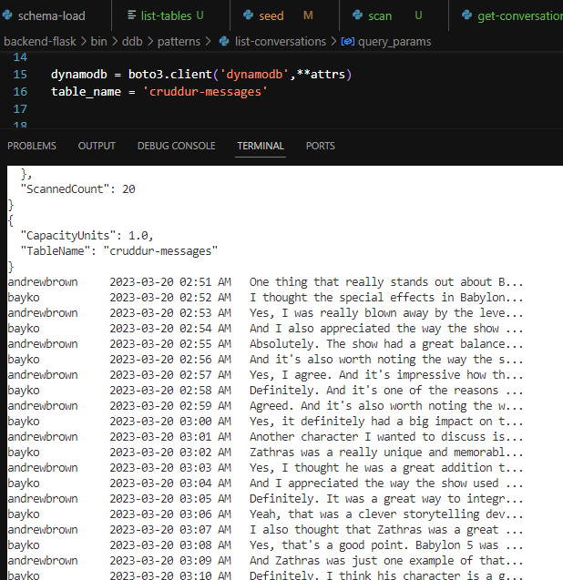  

Added email on seed.sql
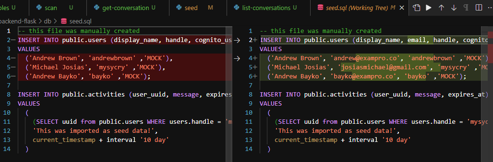  

List users in Cognito
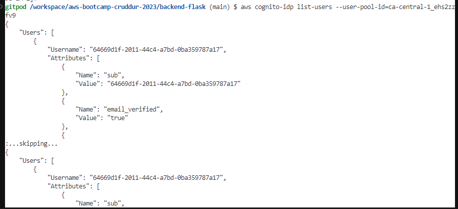  

Update cognito user ids  
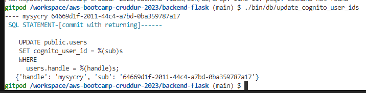  

Query Select * from USERS; in the local database  
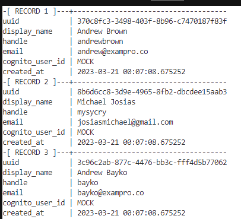  

Added Londo Mollari  
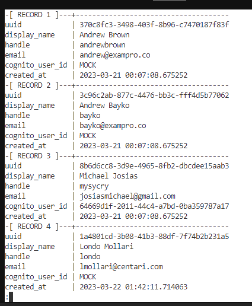  

Sending message a success but 500 error in the app for message group. Adding "return model" in the mesage_group.py solved the problem
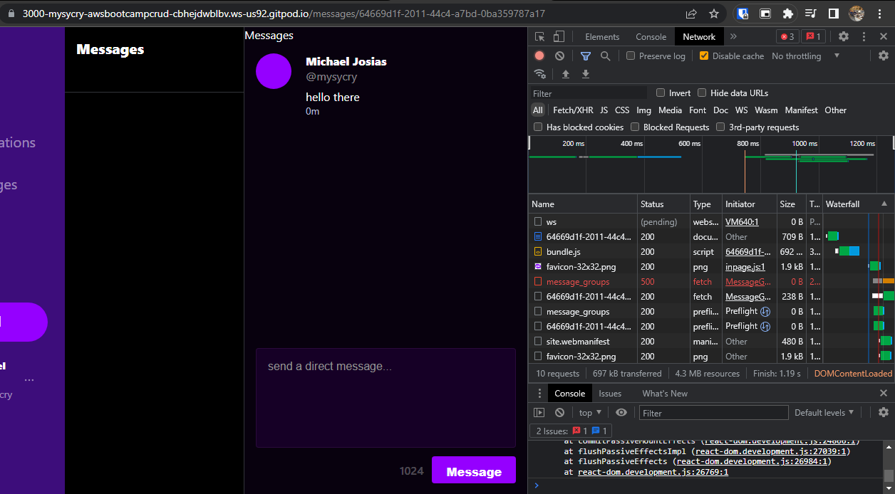  

Replaced Andrew Brown with mine in the database and updated the cognito user ids
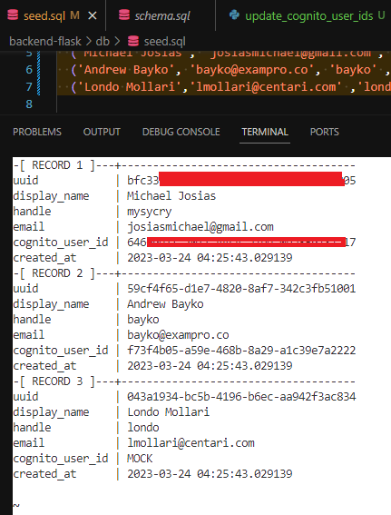  

Messages finally appears. Can send as well
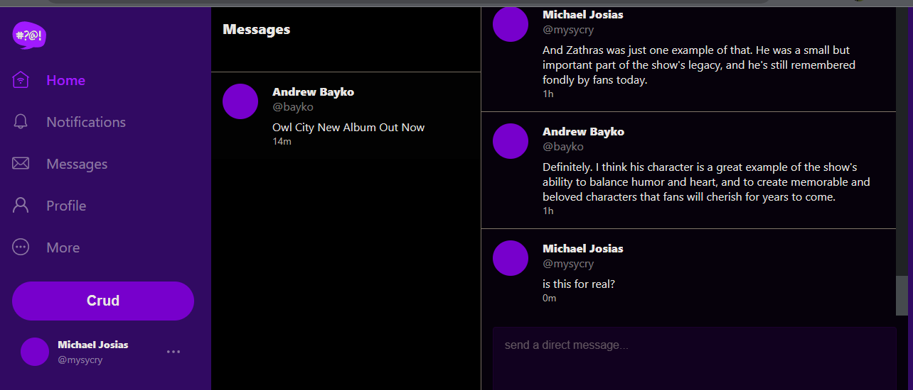  

Started a conversation with Londo
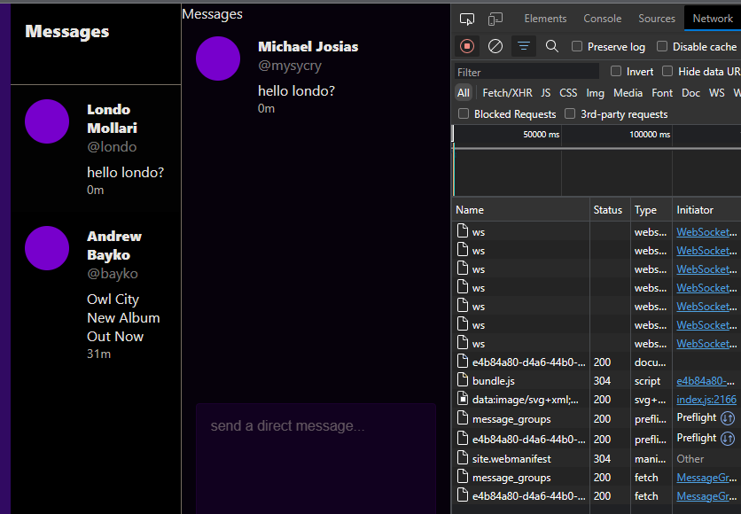  

VPC Endpoint created
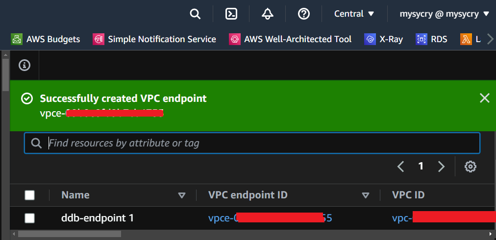  

Sending message in the prod
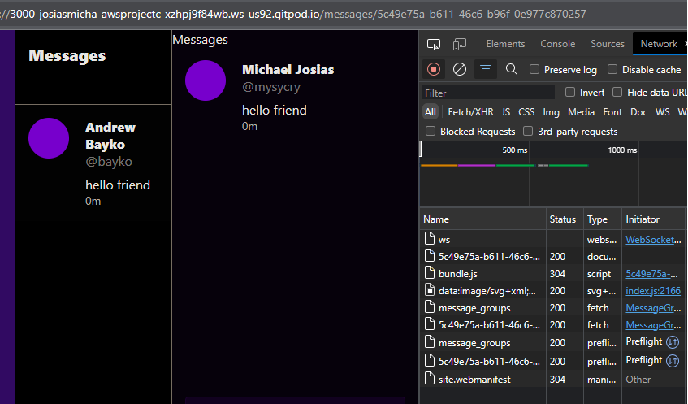  

Sending message to Londo in the prod
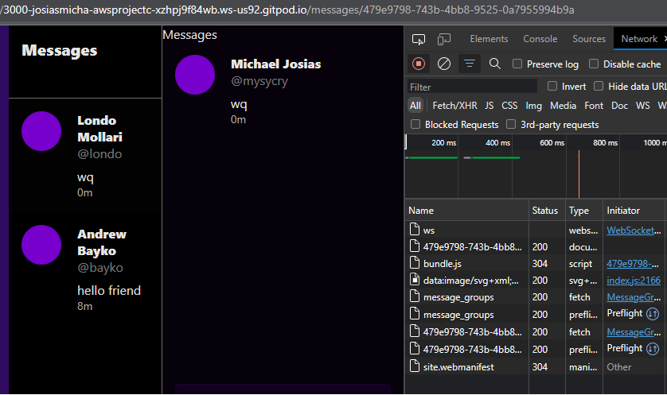  

Inline policy for DynamoDb Stream
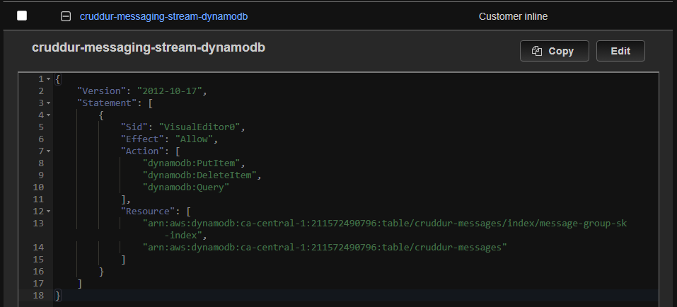  

Cloudwatch logs after sending a message
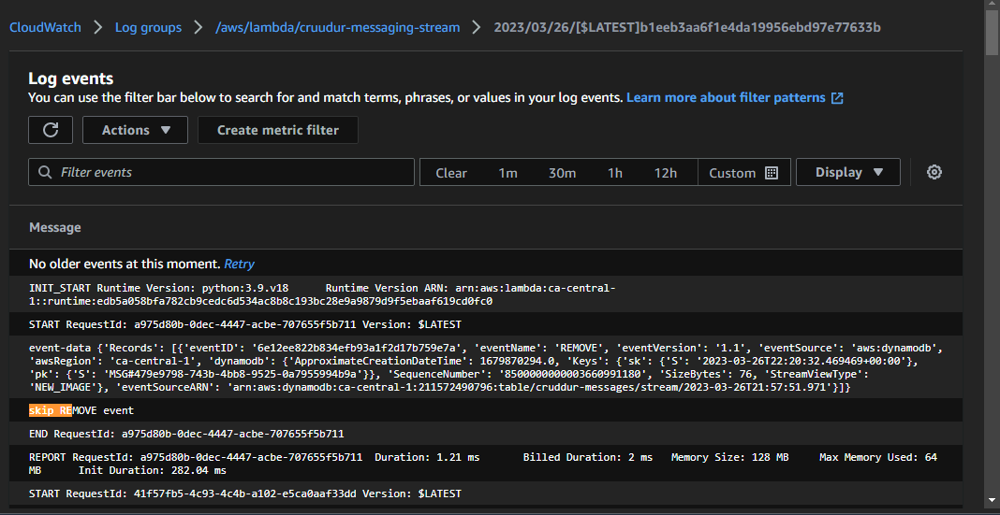  

