# Week 6 — Deploying Containers

All are in Week 6 journal. Week 7 Journal is empty.
Watched all videos related to week 6-7 on the Exampro channel and the bootcamp playlist.

 We test the RDS connection first. Make sure its returns a success. This is the script and I chmod u+x so that it is executable.  
 ```sh
 #!/usr/bin/env python3

import psycopg
import os
import sys

connection_url = os.getenv("CONNECTION_URL")

conn = None
try:
  print('attempting connection')
  conn = psycopg.connect(connection_url)
  print("Connection successful!")
except psycopg.Error as e:
  print("Unable to connect to the database:", e)
finally:
  conn.close()
  ```  
  It returns:  
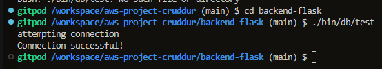

Export the env vars before starting and use the ECR CLI command to log-in.  
```sh
aws ecr get-login-password --region $AWS_DEFAULT_REGION | docker login --username AWS --password-stdin "$AWS_ACCOUNT_ID.dkr.ecr.$AWS_DEFAULT_REGION.amazonaws.com"
```  
Screenshot of exporting env vars and logging in via CLI:  
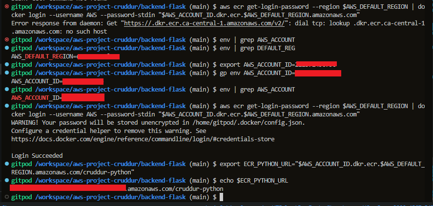  

I used the CLI to create an ECR image.I tag them as latest and push them  
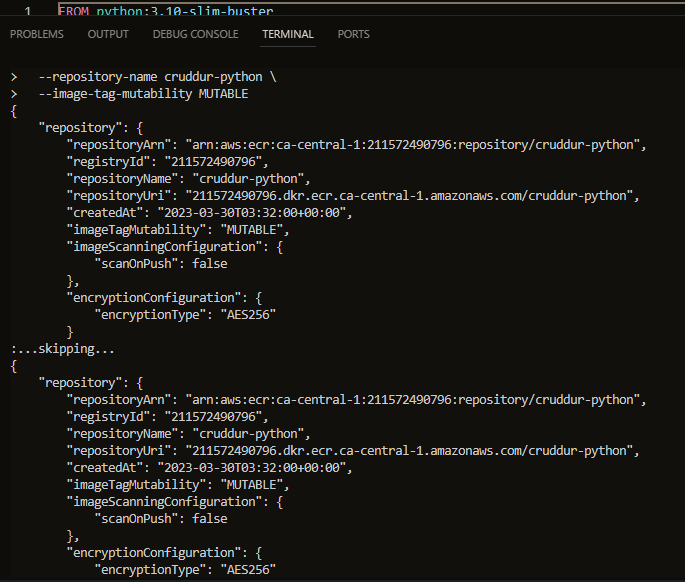  


After creating the containers, run them using this command e.g. frontend-react-js image  
```sh
docker run --rm -p 3000:3000 -it frontend-react-js 
```  
I then check the task inside and its health  
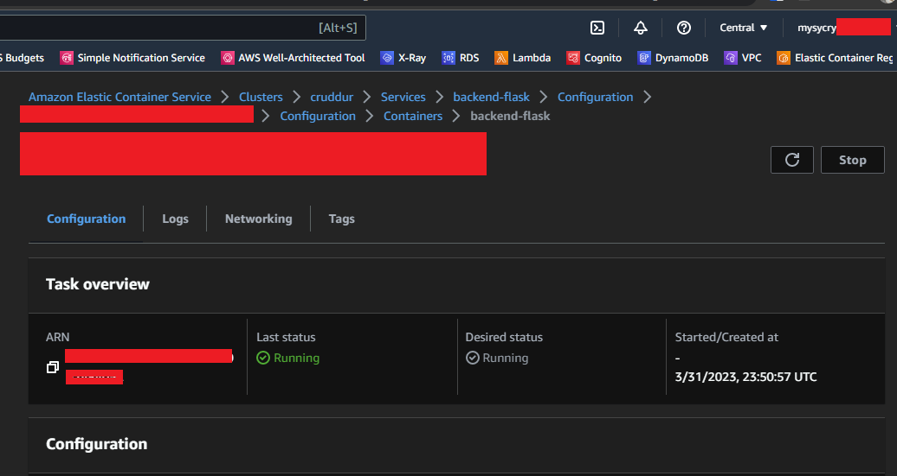  
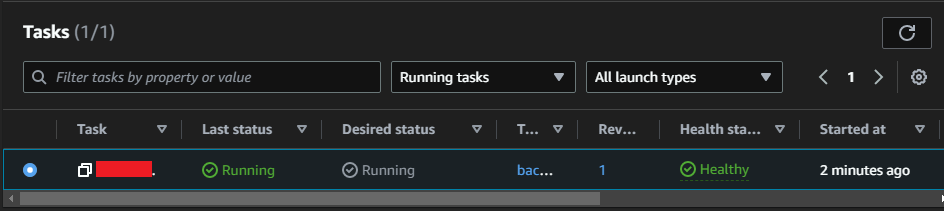  
Frontend task:  
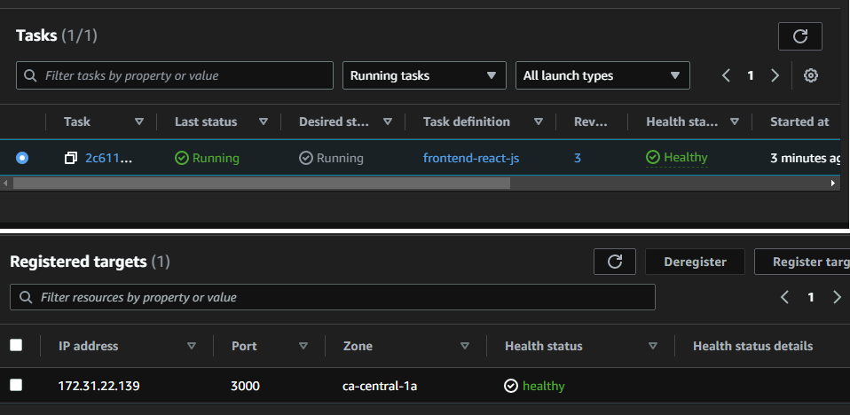  

I get inside the container shell using this command. That task number is unique to mine. so you need to change yours.  
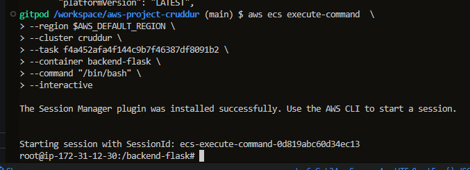  
I then run the health-check from the inside.  
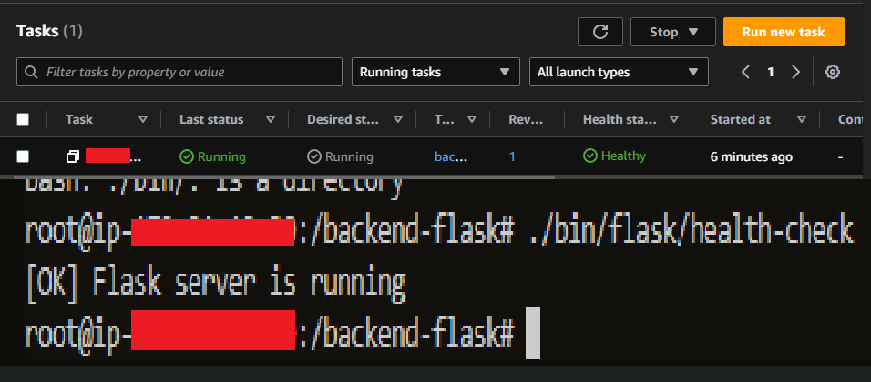  

I tested the IP:4567/api/health-check and it's returns OK  
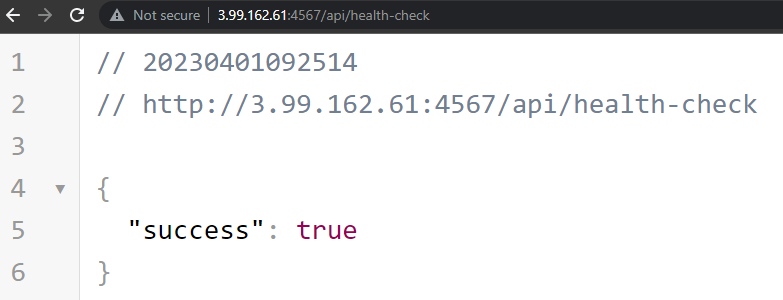  

Healh-check using the ALB endpoint  
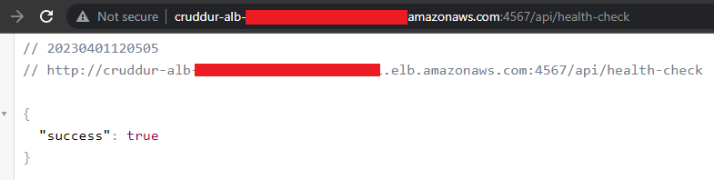  
Backend:  
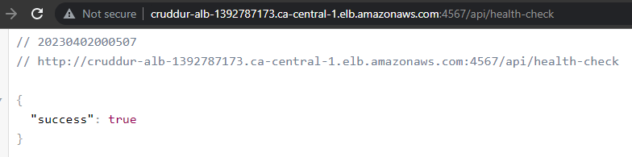  

I have 2 services in ECS one for frontend and one for backend.  
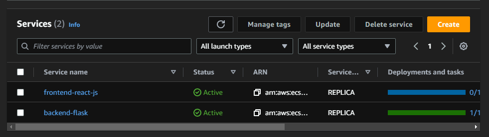  

Target Groups all Healthy  
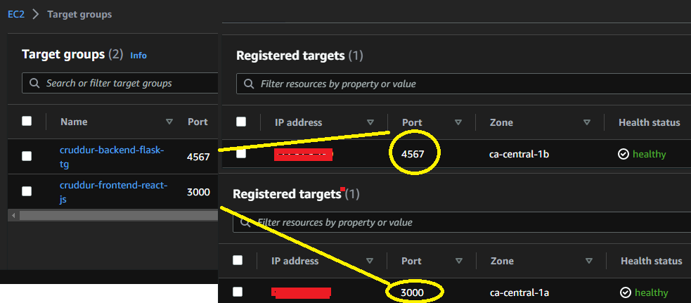  

Frontend ALB Working  
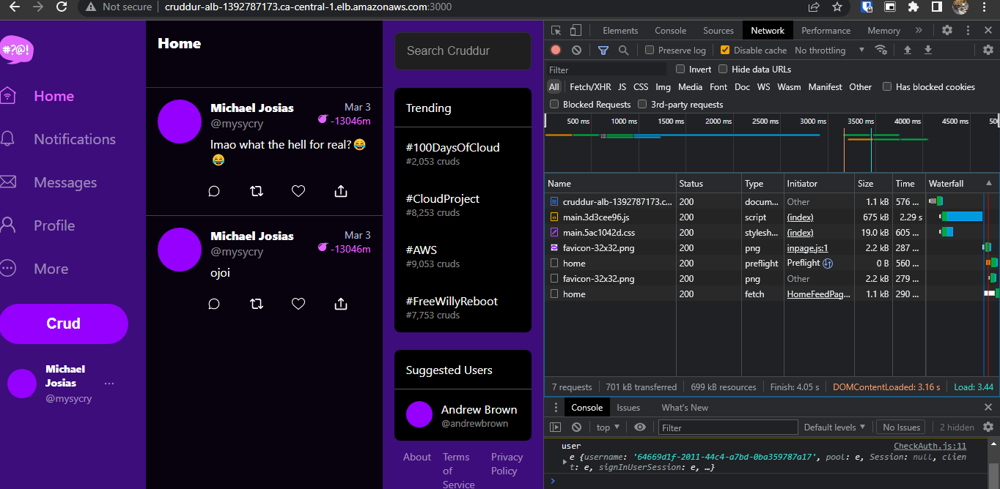  

Backend ALB Working  
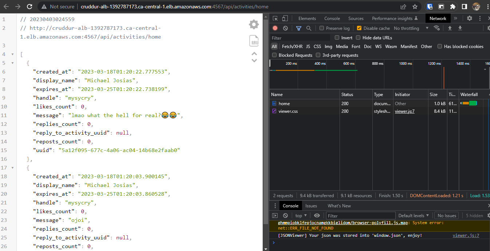  

Hosted Zone and Records request. It costs 0.50cents per hosted zone and it took a few minutes before it passes the validation for the records.  
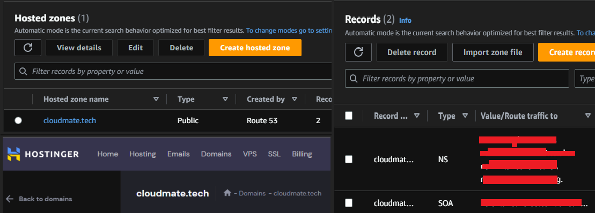  

Forwarding Rules added  
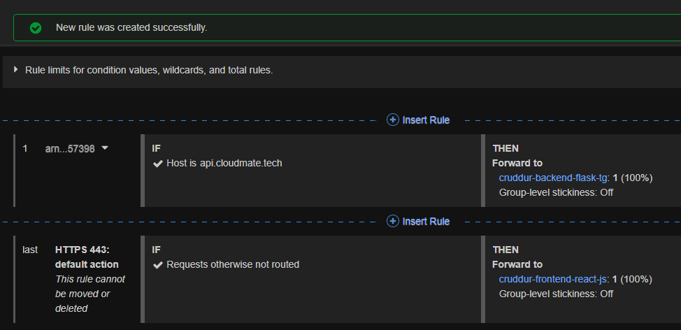  

Backend health-check using the domain I bought  
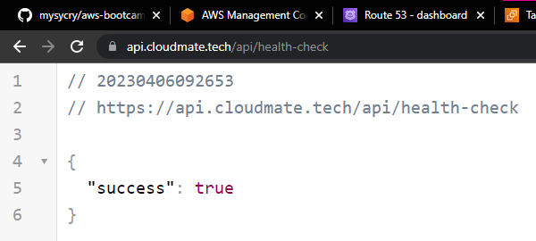  

Domain Backend URL  
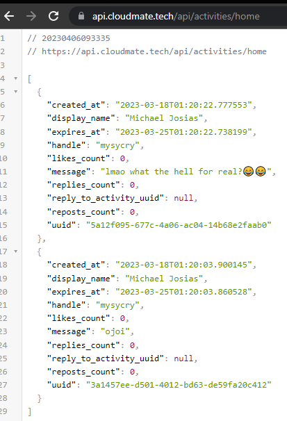  

Back to Local, debugging Flask  
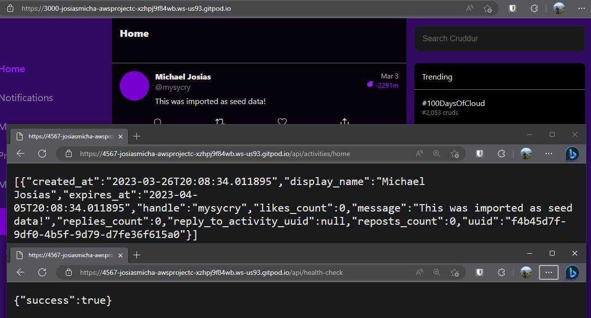  

Bayko Short URL page using my Domain  
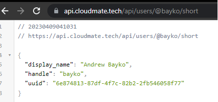  
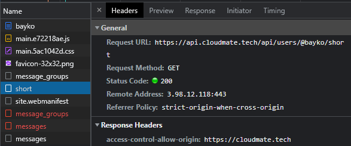  

Created backend env vars  
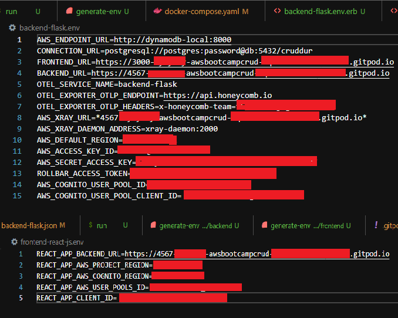  

Configured task definitions to add Xray  
  

Tested locally after passing env vars, App works perfectly.  
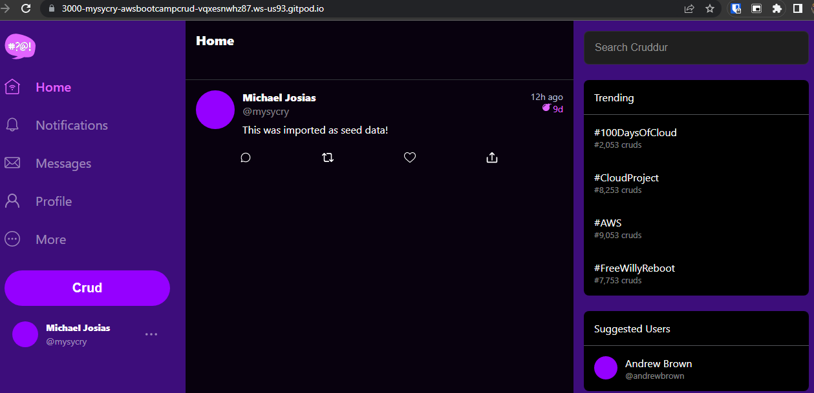  

