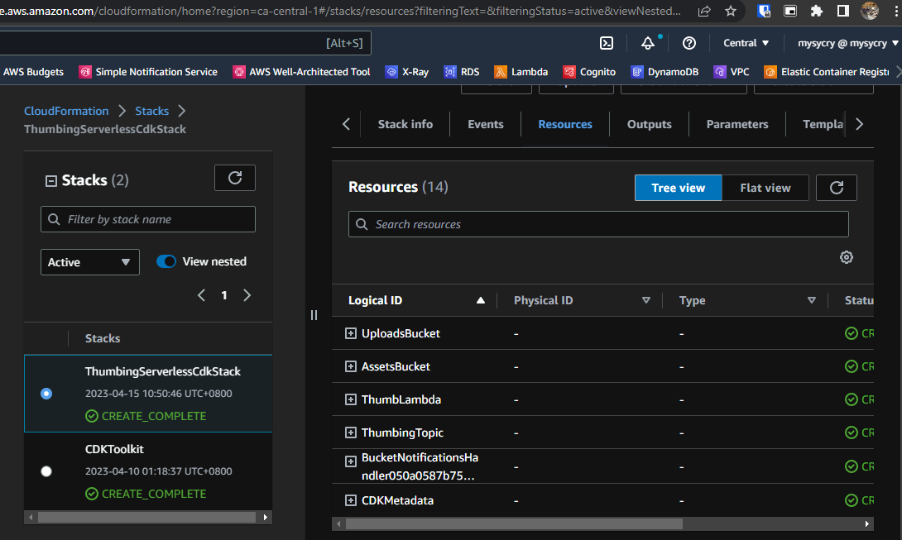
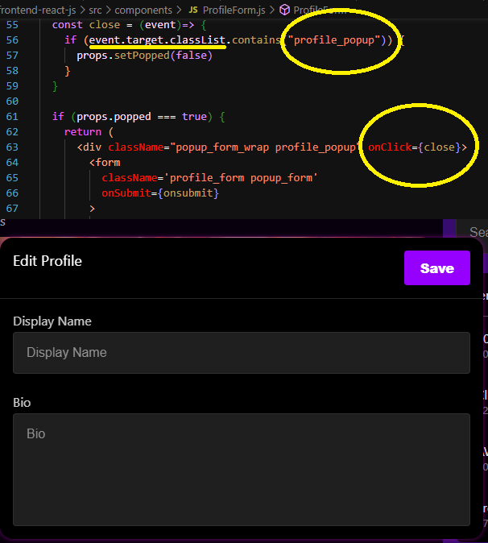
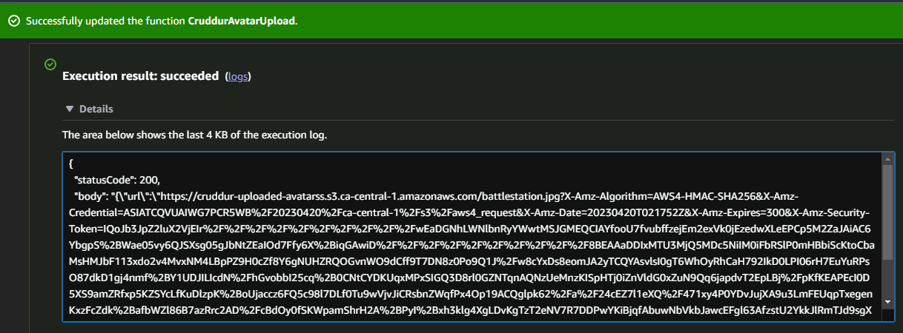

# Week 8 — Serverless Image Processing

Such a challenging week. Plenty of bugs and errors that needs to be fixed. Luckily, I have the time in the weekends to double time on this project. Watched Andrew's CORS videos a couple times each just to get down to it. Asked the Discord group if they can help, even ChatGPT is so helpful.  

This week started with installing AWS CDK (Cloud Development Kit) which is an IaC (Infrastructure as Code) for provisioning and managing cloud resources in an automated and declarative way.  ```npm install aws-cdk -g```  

We also add this on gitpod.yml  
```  - name: cdk
    before: |
      npm install aws-cdk -g 
 ```  
It will then populate this directory.  
  

We need to run ```cdk bootstrap``` before running ```cdk deploy``` when using the AWS Cloud Development Kit (CDK) for the first time in a new AWS account or region. The cdk bootstrap command sets up the necessary resources, such as an S3 bucket and an Amazon S3 object, that are used for storing the deployment artifacts of your CDK applications. These resources are required for packaging and deploying the CDK application's artifacts during the cdk deploy command.  
  

CDK Deploy ==>  
  

There's a confirmation message before we can deploy the resources.  
  

Successful deployment ==>   
  
  

We then go proceed and make a bucket for storage of the profile pictures of our users in the app. These photos will be stored in different folders as you can see in the screenshot. You can also see their difference in size. Another folder is also created for the banner photos.  
  

A bucket policy is created to perform its task.  
  

2 Lambda functions are created to trigger the upload of images and to process them as well.  2 bash files are also created to fasten the testing to see if the lambdas work namely: ```upload``` ```clear```  
  

An updated profile page with the profile photo and banner.  
  

An "Edit Profile" button is added on the profile page and here's the code behind it.  
  

When a user wants to edit his bio, we need to store it somewhere. One solution is to include it on the user in our database. Created executable scripts ```bin/db/migrate```, ```bin/db/rollback```  
  
  
  
  

Here's the updated Edit Profile button in the app now. Soon, we will add another button to change profile picture.  
  

Bio and Display Name shows up in the page.  
  

What it looks like in the database  
  

To upload the avatars, we will make a POST request to the /avatars/key_upload resource at ```https://<API_ID>.execute-api.<AWS_REGION>.amazonaws.com/```, you can find it in the API Gateway you created. To handle this request, we will create a Lambda function called CruddurAvatarUpload that will decode the URL and process the request. Additionally, we will implement authorization using another Lambda function called CruddurApiGatewayLambdaAuthorizer to control the data that can be transmitted from our gitpod workspace using the APIs.  
  
  
  

I encountered errors on my Lambdas so I asked ChatGPT for advices and it turns out I have to install the aws-jwt-verify in the root directory as well aside from its designated path. I also added this code to my function.rb in CruddurAvatarUpload Lambda.  
  
  

In this screenshot, you can see that the new photo is uploaded to the S3 bucket.  The pre-signed URL works.  
  

S3 bucket after a successful upload.  
  

When I try to upload a couple times, I noticed that the photo will not automatically change after a refresh. So I read into Discord Week 8 channel and I found out that I need to make an invalidation rule on my Distro in Cloudfront. ```/avatars/*```    
  
  


