# Week 9 — CI/CD with CodePipeline, CodeBuild and CodeDeploy  

I started the week with an error in my Gitpod when I compose up. After investigating, I found out that @app.before_first_request has been removed from flask. Workaround is to replace it with ```with app.app_context():``` in app.py file.  
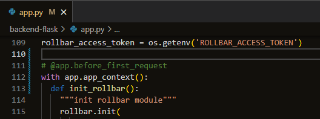  
Another issue is that the frontend and backend ports are on "Detecting.....". Fellow bootcampers found a workaround to access the page:  

```sh
gp preview $(gp url 4567) --external
gp preview $(gp url 3000) --external
```  

We need to make a ```prod``` branch and that's where we merge the new commits from main to trigger the CodePipeline.  

We need to create a ```backend-flask/buildspec.yml``` first. Also make ```ecr-codebuild-backend-role.json``` for a successful building. I have this error when I don't have that policy yet.  
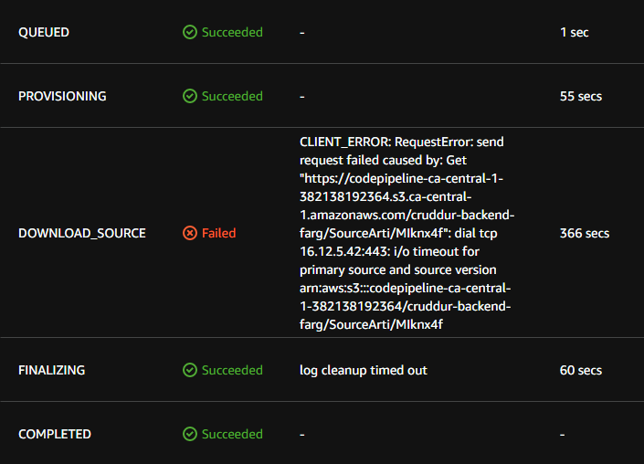  
After adding the policy. Build 13 succedded.  
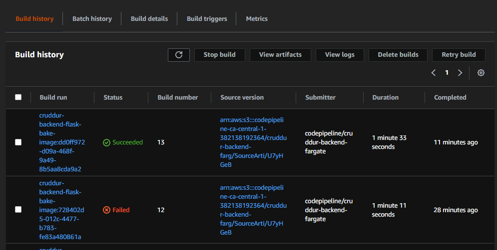  
What does the policy looks like?  
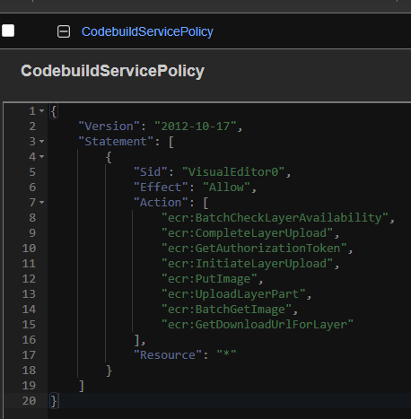  

# AWS CodeBuild  

Create a ```cruddur-backend-flask-bake-image```.  

Source provider will be Github, repository is my ```mysycry/aws-bootcamp-cruddur-2023```. set source version to ```prod```. After a pull request, the build will be automatically triggered as you can see in this screenshot.  
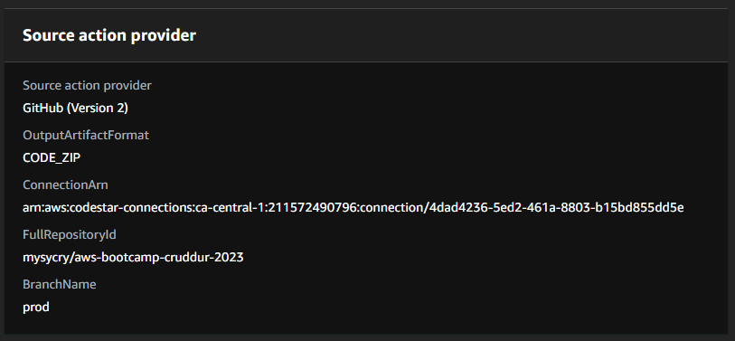  

Then I have this error in CodeBuild, then after an investigation, all I need to do is to raise a ticket to AWS Support and ask for an increase in concurrent build. In less than 24hrs, they responded and they ask for my region and how many builds. I told them 20. They then work on it, then after a day, they inform me that the engineers are done with my request.  
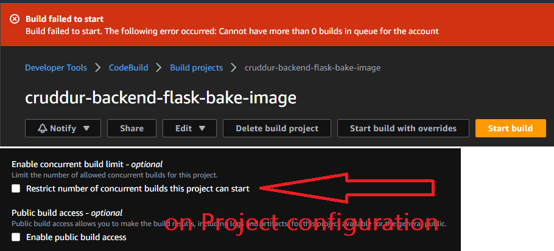  

In the Environment of the Build, create a new role automatically named as ```codebuild-cruddur-backend-flask-bake-image-service-role```  
and decrease timeout to 20 min, don't select any certificate nor a VPC, select compute as 3 GB memory and 2 vCPUs  

Buildspec file is ```backend-flask/buildspec.yml```  
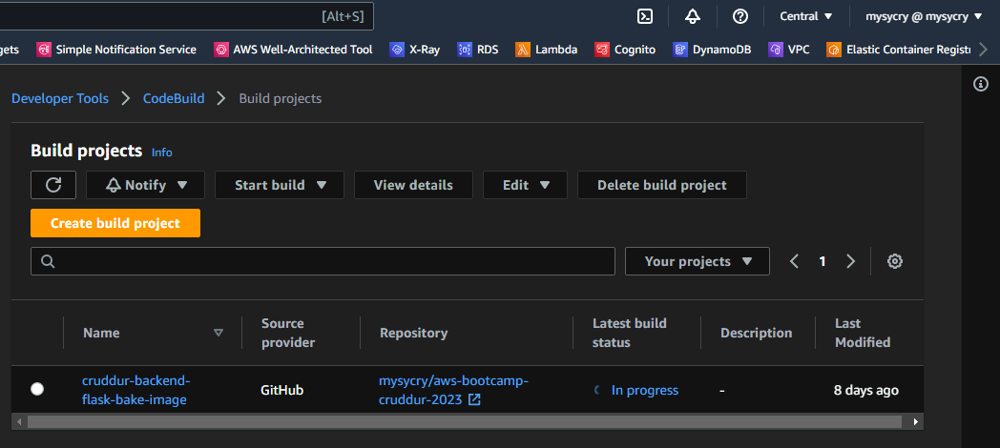  

# AWS CodePipeline  

Pipeline name is ```cruddur-backend-fargate```. Source stage is GitHub (Version 2), click "Connect to GitHub", set connection name as ```cruddur```, install a new app, select the cruddur repo, in the end finish "Connect to GitHub" and back to the pipeline page.  
Select the cruddur repo and select branch prod, select "start the pipeline on source code change" and default output artifact format.  
For build stage, select ```AWS CodeBuild``` as build provider, select your region, select the newly created project ```cruddur-backend-flask-bake-image```.  
For deploy stage: select ```ECS``` as deploy provider, choose cruddur cluster, backend-flask service.  

# Testing  

Edit some codes in Gitpod then commit them. Create a pull request and merge the main branch to the prod branch. It will then trigger the Code Pipeline.  
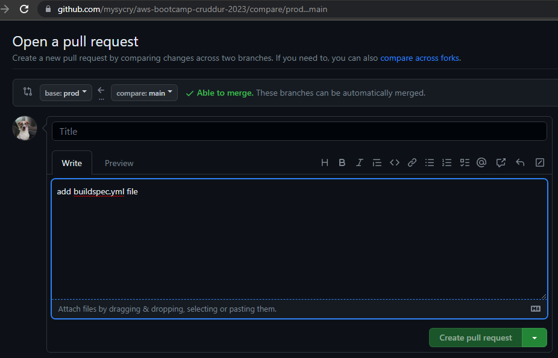  

Below screenshot shows a successful pipeline.  
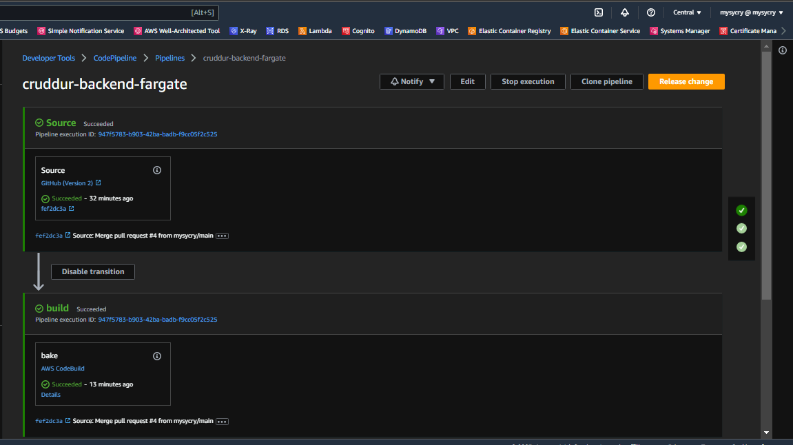  
The Build Logs:  
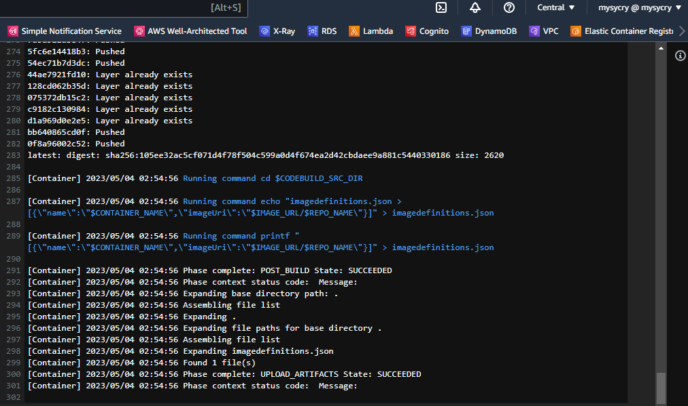  
I updated the health-check in my repo and merge the changes to prod, triggered the pipeline, went successful.  
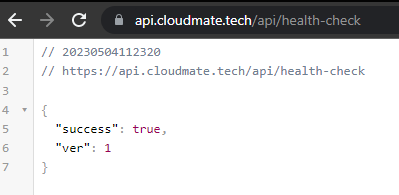   
